Matlab DataONE Toolbox Walk-through
===================================
To understand the Matlab DataONE Toolbox, we'll step through an example by first connecting to a remote matlab server, installing the toolbox, and using the functions and classes provided with a sample soil mapping script.  The goal of the toolbox is to help scientists manage runs of their scripts, and to track the history of each run in terms of its data inputs and outputs.

.. sectnum::
.. contents::
  :depth: 1

Using the remote Matlab server
------------------------------
To use Matlab on a remote server, we require that you install the X2Go_ client on your machine, configure the client, and connect to the remote server.

.. _X2Go: http:x2go.org

Install the x2go client
~~~~~~~~~~~~~~~~~~~~~~~
Visit the X2Go `download page`, and follow the instructions for your operating system.  Note that on Mac OS X, an X server is a pre-requisite, so you may need to install XQuartz_.

.. _XQuartz: http://xquartz.macosforge.org/landing/

Configure an X2Go session
~~~~~~~~~~~~~~~~~~~~~~~~~
Open the X2Go application and choose the  Session > New Session ... menu item.

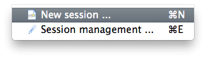

Configure the session with the following values. User names that were created are: 

- schwalm
- aulenbach
- brin
- bocinsky

.. table: Session values

============== ======================
   Setting             Value
============== ======================
 Session name   Aurora DataONE
 Host           aurora.nceas.ucsb.edu
 login          <your-username>
 SSH port       22
 Session type   XFCE
============== ======================

Once configured, choose **OK**:

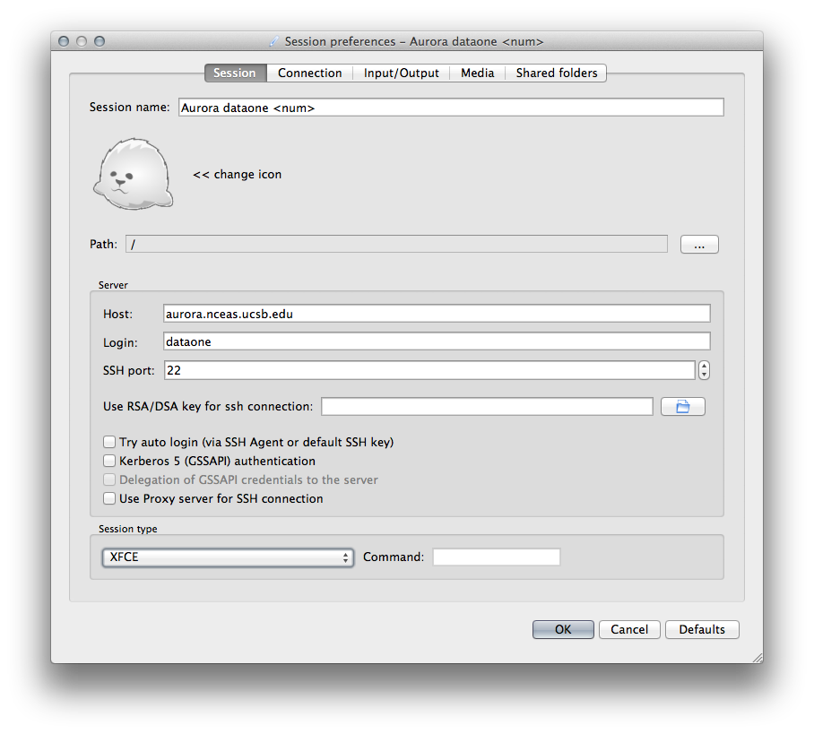

Connect to the remote Matlab server
~~~~~~~~~~~~~~~~~~~~~~~~~~~~~~~~~~~
To connect, click on the configured X2Go grey session box, and **log in** using your password provided during our meeting:

.. image:: images/x2go-install/x2go-login.png

Once logged in, a remote desktop window will open.  In this window, **open Matlab** by choosing the Applications Menu > Development > Matlab menu item:
  
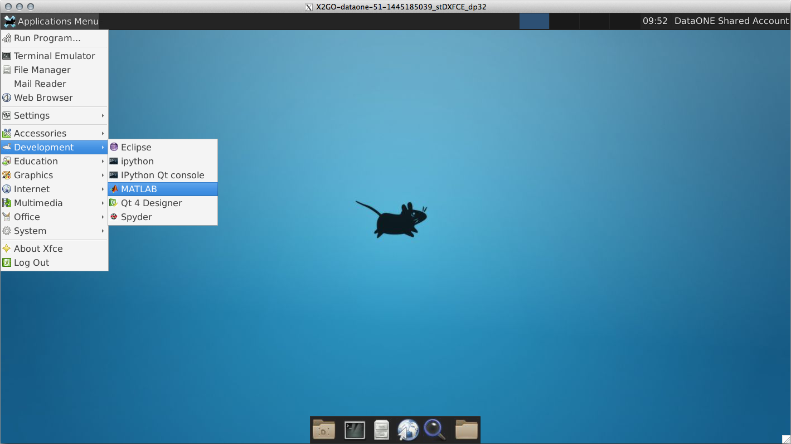

Open these instructions in a remote browser
~~~~~~~~~~~~~~~~~~~~~~~~~~~~~~~~~~~~~~~~~~~
To help with copy/paste of commands, **open a browser** by choosing Applications Menu > Web Browser menu item, and navigate to **https://goo.gl/vqBTwI**

Installing the toolbox
----------------------
In Matlab, **change to the Desktop/matlab-dataone** directory.  

.. code:: matlab
  
  cd Desktop/matlab-dataone

In this directory, **run the `install_matlab_dataone.m` file**.

.. code:: matlab
  
  install_matlab_dataone

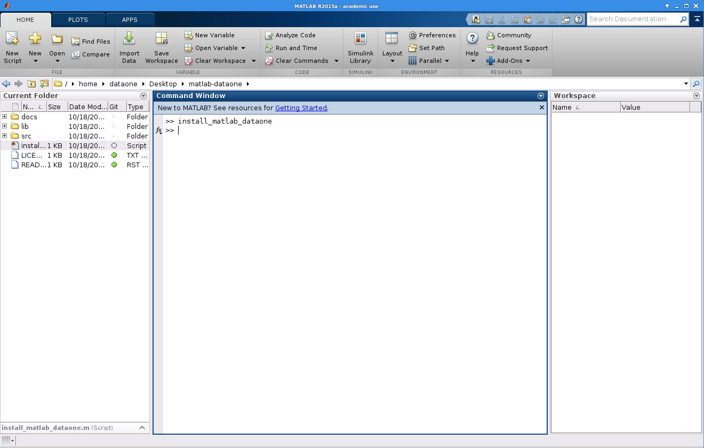

Once the toolbox is installed, **restart Matlab** to ensure all libraries are available.

Using the toolbox
----------------- 
Explore the C3 C4 soil mapping code
~~~~~~~~~~~~~~~~~~~~~~~~~~~~~~~~~~~
To start out, have a look at the example soil data processing code.  In Matlab, **change to the example directory**:

.. code:: matlab

  cd Desktop/C3_C4_mapping
  
First, **open the `C3_C4_map_present_NA.m` script**, and peruse the code.  Notice the sections where data are pulled in as input, which processing algorithm is used, and what data artifacts are output.

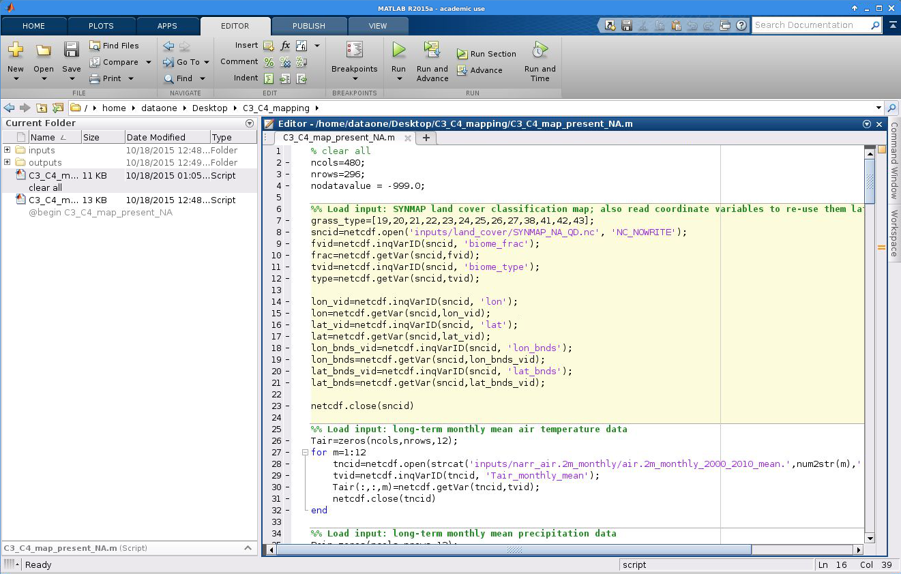

Create a Configuration object
~~~~~~~~~~~~~~~~~~~~~~~~~~~~~
**Customize the RunManager** with settings that are specific to your session. 

 **Note:** Changing the 'configuration_directory' property is typically not needed. We are using the directory on the desktop for ease of access.

.. code:: matlab

  % Create a Configuration object
  import org.dataone.client.configure.Configuration;
  config = Configuration('configuration_directory', '/home/<your-username>/Desktop/<your-username>');

  
Create a RunManager object
~~~~~~~~~~~~~~~~~~~~~~~~~~
To record a run of a script in Matlab, first import the `RunManager` class, and **create a RunManager object** in the Command Window:

.. code:: matlab

  import org.dataone.client.run.RunManager;
  mgr = RunManager.getInstance(config); % Pass the config in from above
    
You can look at the documentation of the RunManager class using:

.. code:: matlab

  doc RunManager

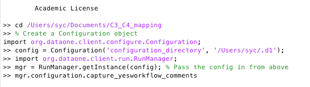

Record a script processing soil data
~~~~~~~~~~~~~~~~~~~~~~~~~~~~~~~~~~~~
To **record a script** run, pass it to the RunManager's record() function, and add a tag to to help keep track of your runs:

.. code:: matlab

  mgr.record('/home/<your-username>/Desktop/C3_C4_mapping/C3_C4_map_present_NA.m', 'algorithm 1, no markup');
  
This will run the script, and will track data input and output files that are read, and will store  to a cache directory, along with other run metadata.

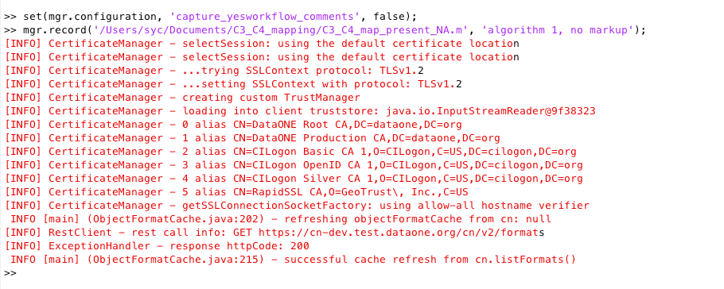

Record a run with a script with workflow comments
~~~~~~~~~~~~~~~~~~~~~~~~~~~~~~~~~~~~~~~~~~~~~~~~~
Now, **record another run**, but this time, use the script that has been documented using the workflow comments using the YesWorkflow syntax  .  The comments define blocks in the code with '**@begin**', '**@end**', '**@in**' and '**@out**' statements.  First, peruse the 'C3_C4_map_present_NA_with_comments.m' script and see how YesWorkflow comments communicate the planned workflow:

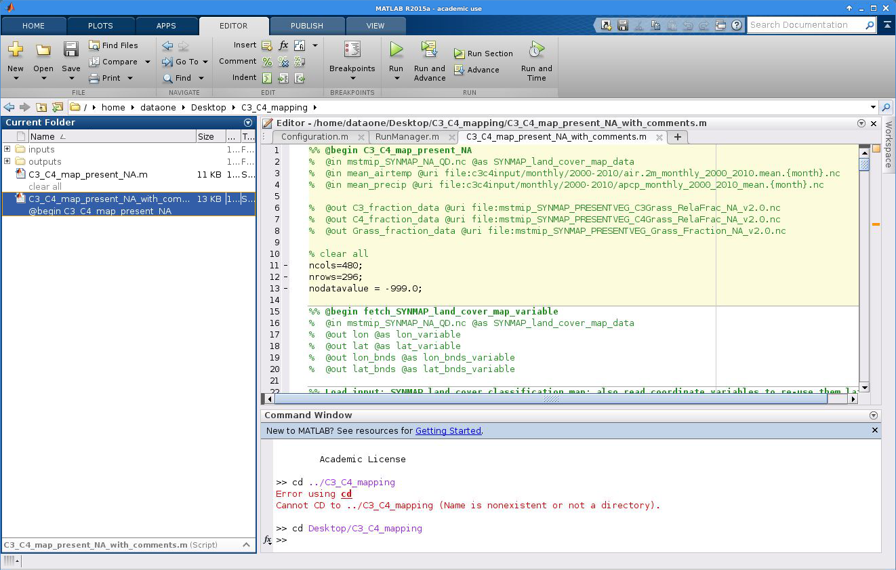

Then, record a second run using this script, and tag the run accordingly. Prior to using the YesWorkflow capture, enable it in your configuration:

.. code:: matlab
  
  set(mgr.configuration, 'capture_yesworkflow_comments', true);
  mgr.record('/home/<your-username>/Desktop/C3_C4_mapping/C3_C4_map_present_NA_with_comments.m', 'algorithm 1, with YW comments');

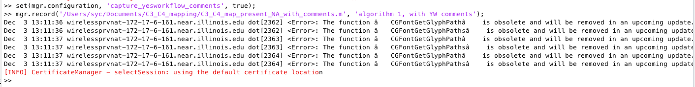

List the completed runs
~~~~~~~~~~~~~~~~~~~~~~~
Now that you have completed two runs, **view the runs** using the listRuns() function:

.. code:: matlab

  mgr.listRuns();

.. image:: images/walkthrough-images/sec3.6-listRuns()-output.png

  
The number of runs you produce might get very long, so you can filter the runs by startDate, endDate, tags, or runNumber, such as:

.. code:: matlab

  mgr.listRuns('tags', 'algorithm 1, no markup');

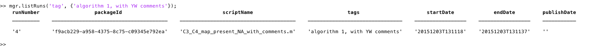

  mgr.listRuns('runNumber', 2);

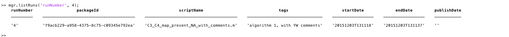

  mgr.listRuns('startDate', '20151027T080000', 'endDate', '20151030T080000');

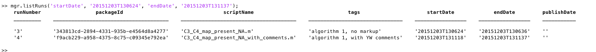

View a selected run
~~~~~~~~~~~~~~~~~~~
To view a given run, pass in the runNumber or packageId from one of the resulting rows from the output of listRuns().  For instance:

.. code:: matlab
  
  mgr.view('runNumber', 1);

.. image:: images/walkthrough-images/sec3.7-view(yw-basic-output).png

The output of the view() function provides more technical details about the run. You can also see the provenance details of the run by showing the 'used' and 'generated' sections, like:

.. code:: matlab

  mgr.view('runNumber', 1, 'sections', {'details', 'used', 'generated'});

.. image:: images/walkthrough-images/sec3.7-view(yw-all-output).png

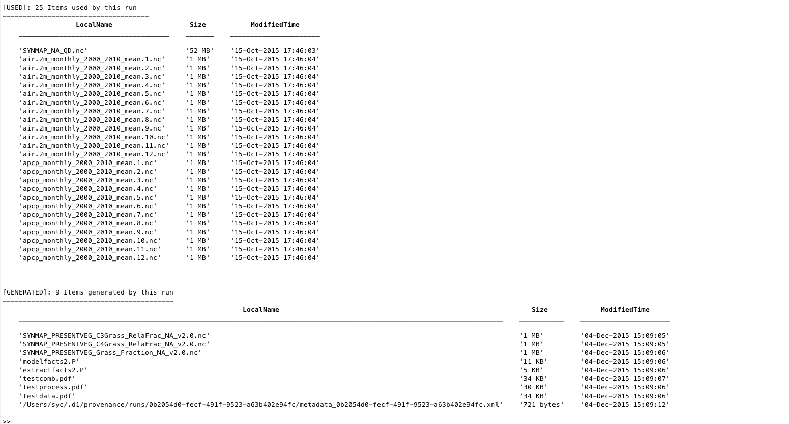

View YesWorkflow diagrams
~~~~~~~~~~~~~~~~~~~~~~~~~~~~~~~~~~
Workflow provenance is captured with the YesWorkflow tool, and it outputs three diagrams: data flow, process flow, and combined data and process flow.  Have a look at the three diagrams by opening your configuration folder on your Desktop, and navigating into the Desktop > <your-username> > provenance > runs > <run_id> folder.  These PDF files will be named 'testdata_7.pdf', 'testprocess_7.pdf', and 'testcomb_7.pdf'. An example of the combined workflow view is below:

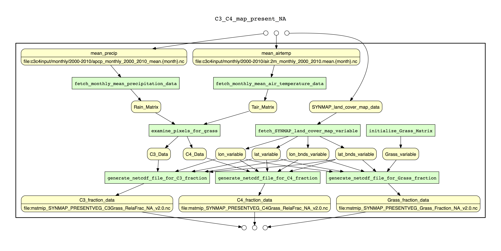

Delete a selected run
~~~~~~~~~~~~~~~~~~~~~
If a run wasn't useful, you can **delete one or more runs** from the database using the deleteRuns() function. Try deleting your first run and then listing the runs again:

.. code:: matlab

  mgr.deleteRuns('runNumber', 1);
  mgr.listRuns();

.. image:: images/walkthrough-images/sec3.9-delete( )-output.png

View and modify metadata for a run
~~~~~~~~~~~~~~~~~~~~~~~~~~~~~~~~~~
Basic metadata are generated for each run.  The toolbox provides a template metadata file that will be populated with preset configuration properties.  For instance, by setting the following values, each metadata document for a run will contain these values:

.. code:: matlab
  
  set(mgr.configuration.science_metadata_config, 'title_prefix', 'MsTMIP: C3 C4 soil map processing: ');
  set(mgr.configuration.science_metadata_config, 'title_suffix', '');
  set(mgr.configuration.science_metadata_config, 'primary_creator_salutation', 'Dr.');
  set(mgr.configuration.science_metadata_config, 'primary_creator_givenname', 'Yaxing');
  set(mgr.configuration.science_metadata_config, 'primary_creator_surname', 'Wei');
  set(mgr.configuration.science_metadata_config, 'primary_creator_address1', 'Environmental Sciences Division');
  set(mgr.configuration.science_metadata_config, 'primary_creator_address2', 'Oak Ridge National Laboratory');
  set(mgr.configuration.science_metadata_config, 'primary_creator_city', 'Oak Ridge');
  set(mgr.configuration.science_metadata_config, 'primary_creator_state', 'TN');
  set(mgr.configuration.science_metadata_config, 'primary_creator_zipcode', '37831-6290');
  set(mgr.configuration.science_metadata_config, 'primary_creator_country', 'USA');
  set(mgr.configuration.science_metadata_config, 'primary_creator_email', 'weiy@ornl.gov');
  set(mgr.configuration.science_metadata_config, 'language', 'English');
  set(mgr.configuration.science_metadata_config, 'abstract', 'Global land surfaces are classified by their relative fraction of Carbon 3 or Carbon 4 grasses, ...');
  set(mgr.configuration.science_metadata_config, 'keyword1', 'Carbon 3');
  set(mgr.configuration.science_metadata_config, 'keyword2', 'Carbon 4');
  set(mgr.configuration.science_metadata_config, 'keyword3', 'soil');
  set(mgr.configuration.science_metadata_config, 'keyword4', 'mapping');
  set(mgr.configuration.science_metadata_config, 'keyword5', 'global');
  set(mgr.configuration.science_metadata_config, 'intellectual_rights', 'When using these data, please cite the originators as ...');

To see the metadata that are generated for a run, **pass the packageId to the getMetadata()** function:

.. code:: matlab

  metadata = mgr.getMetadata('86ac27de-f45c-4bc2-ba09-d4bedcec9546'); % Replace the packageId here

You can edit the medata in an external XML editor, or an editor that is aware of the syntax of your metadata standard (by default we generate Ecological Metadata Language files).  Once you've edited the file, you can replace the generated file with:

.. code:: matlab
  
  mgr.putMetadata('86ac27de-f45c-4bc2-ba09-d4bedcec9546', 'path/to/file') % Replace packageId and file path here

  
Publish a selected run
~~~~~~~~~~~~~~~~~~~~~~
With the metadata populated, you may choose to publish a run and its artifacts to a DataONE Member Node.  To do so, **use the publish()** function.  First, set the appropriate Member Node and Coordinating Node configuration properties, along with authentication properties. We'll discuss these in our meeting:

.. code:: matlab

  set(mgr.configuration, 'target_member_node_id', 'urn:node:mnDemo2');
  set(mgr.configuration, 'source_member_node_id', 'urn:node:mnDemo2');
  set(mgr.configuration, 'coordinating_node_base_url', 'https://cn-sandbox-2.test.dataone.org/cn');
  set(mgr.configuration, 'certificate_path', '/tmp/x509up_u501'); 
  set(mgr.configuration, 'authentication_token', 'eyJhbGciOiJSUzI1Ni ...'); % Replace token here
  mgr.publish('86ac27de-f45c-4bc2-ba09-d4bedcec9546'); % replace the packageId here

.. image:: images/walkthrough-images/sec3.11-publish( )-output-1.png
.. image:: images/walkthrough-images/sec3.11-publish( )-output-2.png

Viewing the data package on the web
-----------------------------------
We are still working on getting the appropriate provenance information indexed on the Coordinating Nodes after the publish() call is made.  Lauren will be showing you an example of viewing provenance-enabled metadata on a DataONE search interface.

